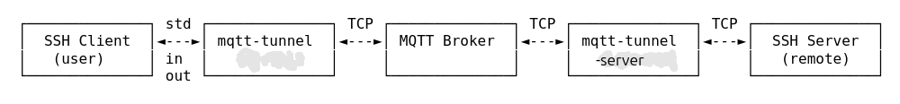

# mqtt-tunnel

Under construction, do not download yet

SSH proxy via MQTT

- **No port forwarding** required
- **No open ports in server firewall**
- **Works with any NAT** configuration. Even with difficult scenarios where hole punching cannot work like double NAT, Symmetric NAT
- **Zero-config** with free public MQTT brokers (Mosquitto, HiveMQ). Maintaining login credentials is a mental burden and a point of failure.
- Perfect for occasional maintenance connections and light work, one off commands
- Useful for android/termux
  > ssh termux-mqtt 'termux-notification -c "Remember the Milk" ; echo Notification sent'
  works the same in home, work wifi or mobile data
- Useful as a second/backup login method for the excellent [gonc](https://github.com/threatexpert/gonc) tool. mqtt-tunnel has faster initial connections, but it is not a gonc replacement (gonc offers direct connections and by implementing encryption, can be used on more tasks other than SSH tunneling).
- mqtt-tunnel data always go via the broker, so the lag is usually noticeable, but perfectly usable.
- The mqtt broker cannot be rate limited.
- It is not a network anonymizer. Use VPN for this purpose.
- The data are encapsulated inside mqtt messages, so there is significant data overhead given that the interactive SSH sessions use very small packets. This may be a concern on metered networks.

### How It Works

1. Client: subscribes to control topic (e.g., baseTopic/ctl)
2. Client → Server: connect (ID, version)  [ID generated by client]
3. Server: checks protocol version - if mismatch sends failure, closes
4. Server: generates topics (ClientPubTopic, ServerPubTopic)
5. Server: subscribes to ClientPubTopic
6. Server → Client: connect_ack (ID, ClientPubTopic, ServerPubTopic) [or failure if version mismatch]
7. Client: subscribes to ServerPubTopic, waits for MQTT broker ACK
8. Client → Server: connect_confirm (ID)
9. Server: receives confirm
10. Server: connects to SSH target (e.g., 127.0.0.1:22)
11. Server: starts reading from SSH, publishing data
12. Bidirectional data transfer begins

### Installation
Binaries are provided in [releases page](https://github.com/yourusername/mqtt-tunnel/releases). The "mqtt-tunnel-arm64" runs on termux/android and is optimized (GOMAXPROCS=1 THREAD=10 DNS=buildin) to avoid being killed by the android system. It is tested with android 15 and 16 and termux(fdroid) without problems.

### 1. Create a Configuration File

Create `client.json` on your PC:

```json
{
    "broker": "mqtt://broker.hivemq.com:1883",
    "topic": "gFAftaCLyD" # generate a new with "mqtt-tunnel -topic generate"
}
```

and `server.json` on the remote SSH server:
```json
{
    "broker": "mqtt://broker.hivemq.com:1883", # the same as client.json
    "topic": "gFAftaCLyD", # the same as client.json
    "server": ":22" # or ":8022" for termux
}
```

#### **Topic Best Practices:**
The topic does not contribute to the SSH security. However it must remain secret and not guessable.

**For public MQTT brokers with no login credentials:**
- Use 8-10 random alphanumeric characters (e.g., `gFAftaCLyD`). Run `mqtt-tunnel -topic generate` to get one
- Avoid slashes (`/`) - they create topic hierarchies that may be accessible via wildcard subscriptions (`#` or `+`). The individual tunnel topics will be subtopics of this.

**For servers with login credentials (for example flespi.io):**

There is no fighting for topics with all the other users, neither need to hide the topic, so:
- You can use shorter topics e.g. `-topic ssh` or `-topic comm/ssh`
- In this case `/` can be useful to limit the mqtt messages in a specific topic hierarchy or to comply with broker rules.

In both cases do not use topics longer than necessary (let's say 10 chars), to avoid increasing the packet size.

**Supported broker URL formats:**

| URL Scheme | Description | Default Port |
|------------|-------------|--------------|
| `mqtt://` | MQTT over TCP (no TLS) | 1883 |
| `mqtts://` | MQTT over TLS | 8883 |
| `ws://` | MQTT over WebSocket | 80 |
| `wss://` | MQTT over Secure WebSocket | 443 |

**Recommended Public Brokers, no credentials needed:**
- `mqtt://broker.hivemq.com:1883` - Reliable, free public broker
- `mqtt://test.mosquitto.org:1883` - Community MQTT broker

These services are provided for the common good. **Please use responsibly**. Avoid large file transfers or sustained high-bandwidth usage.

### 2. Start the Server

On the server (the one you want to SSH into):

```bash
mqtt-tunnel -c server.json
```

Or without a config file:

```bash
mqtt-tunnel -broker mqtt://broker.hivemq.com:1883 -topic gFAftaCLyD -server :22
```

> **Note:** The `-server` flag accepts a shorthand: `:22` is expanded to `127.0.0.1:22`. Use `:8022` for Termux SSH.

**Auto-start on boot** (add to crontab with `crontab -e`, no root is needed):

```bash
# assuming mqtt-tunnel and server.json are under ~/tunnel
@reboot cd /home/user/tunnel && ./mqtt-tunnel -c server.json 2>&1 &
```

### 3. Configure SSH on client machine

**Important:** Before configuring SSH, first test the tunnel standalone to verify it connects successfully:

```bash
mqtt-tunnel -c client.json
```

You should see the SSH server banner (e.g., `SSH-2.0-OpenSSH_8.9`). If you see errors like "protocol version mismatch", you may need to upgrade the server. Once verified working, proceed with SSH configuration below.

To always see mqtt-tunnel progress messages when using SSH, add `"log-file": "/dev/tty"` to your `client.json` (Linux/macOS):

```json
{
    "broker": "mqtt://broker.hivemq.com:1883",
    "topic": "YOUR_TOPIC",
    "log-file": "/dev/tty"
}
```

Add to your `~/.ssh/config`:

```
Host remote-via-mqtt
    HostName remote-server
    ProxyCommand /path/to/mqtt-tunnel -c /path/to/client.json
    # you can add `-log-file /dev/tty` to view the progress when running the ssh command
```

Then connect:

```bash
ssh remote-via-mqtt
```

### Connection Keepalive / Timeout Detection

For fast detection of dead connections (especially useful when switching between networks), configure SSH keepalive with different values for client and server:

**Client side** (fast detection):
```
# ~/.ssh/config
Host remote-via-mqtt
    ServerAliveInterval 5      # Send keepalive every 5 seconds
    ServerAliveCountMax 3      # Disconnect after 3 missed (10s total)
    ProxyCommand /path/to/mqtt-tunnel -c /path/to/config.json
```

**Server side** (conservative, just to clean up stale sessions):
```
# /etc/ssh/sshd_config
ClientAliveInterval 60         # Check every minute
ClientAliveCountMax 3          # Disconnect after 3 minutes of silence
```

Then restart sshd

**Traffic impact:** ~1-2 KB/minute on client, almost nothing on server.

### Termux (Android SSH Server) Setup

**mqtt-tunnel is especially useful with Termux** - access your phone/termux from anywhere regardless of network changes (WiFi → mobile data, different WiFi networks, etc.).

**Configure sshd keepalive in Termux:**

```bash
# Edit sshd config
nano $PREFIX/etc/ssh/sshd_config

# Add these lines:
ClientAliveInterval 60
ClientAliveCountMax 3

# Restart sshd
pkill sshd && sshd
```

**Auto-start sshd when Termux opens** (add to `~/.bashrc`):
```bash
# Start sshd if not running
if ! pgrep -x "sshd" > /dev/null; then
    sshd
fi
```

**Typical setup:**
```bash
# On phone (Termux):
# Install: pkg install openssh termux-api
# Generate topic: mqtt-tunnel -topic generate
mqtt-tunnel -broker mqtt://broker.hivemq.com:1883 -topic YOUR_TOPIC -server :8022

# On laptop (~/.ssh/config):
Host termux-phone
    HostName termux
    ServerAliveInterval 10
    ServerAliveCountMax 3
    ProxyCommand -c /path/to/client.json
    # or ProxyCommand /path/to/mqtt-tunnel -broker mqtt://broker.hivemq.com:1883 -topic YOUR_TOPIC
```

### 4. Test the Connection

To verify the tunnel works without using SSH:

```bash
mqtt-tunnel -c /path/to/client.json
```

If you can see the SSH server banner (e.g., `SSH-2.0-OpenSSH_8.9`), the tunnel is working

## Configuration Options

Generate a sample config:

```bash
mqtt-tunnel -config help
```

## Command-Line Options

```
mqtt-tunnel -help
```

## Troubleshooting

When connection issues arise, the first step is to enable verbose logging to see what's happening. Run:

```bash
mqtt-tunnel -c client.json -verbose
```

**What to look for in the logs:**

The startup log lines show critical connection details:
```
2026/03/25 07:12:51 [INFO] Client mode
2026/03/25 07:12:51 [INFO]   app-version=0.5.1
2026/03/25 07:12:51 [INFO]   wire-protocol=2
2026/03/25 07:12:51 [INFO]   root-topic=Ktt91J5q
```

- **app-version**: Check if the client matches your server version
- **wire-protocol**: Must match between client and server (currently 2)
- **root-topic**: Verify this matches your server's topic

**Common log messages:**

| Message | Meaning |
|---------|---------|
| `Client mode` / `Server mode` | Successfully determined mode |
| `successfully connected to MQTT broker` | MQTT connection working |
| `topic subscribing` | Subscribed to control topics |
| `ack received` | Server acknowledged connection, topics assigned |
| `protocol version mismatch` | Client and server have different protocol versions - update both |

**Still having issues?**

- Ensure the server is running first, then connect the client
- Verify the topic matches between client and server config
- Check that the MQTT broker URL is accessible from both machines
- For TLS issues, verify certificates are correct

## Security Considerations

> ⚠️ **This tool provides no encryption.** The MQTT tunnel itself is unencrypted.

- **Always use SSH** (or another encrypted protocol) through the tunnel
- The topic name acts as a shared secret. Use a (10 chars is OK) random string (generate with `-topic generate`)
- **Avoid slashes** in topics on public brokers, they may be exposed via wildcard subscriptions
- Be aware that MQTT brokers with wildcard access (`#`) could expose your traffic metadata anyway.

You can consider:
  - **Transport encryption (`mqtts://` or `wss://`):** Protects the topic name from eavesdropping on the wire, but adds latency. Since SSH is already end-to-end encrypted, you may prefer `mqtt://` for better performance. However, do your own tests.
- **MQTT broker authentication:** Requires account to maintain, but prevents topic leakage. Public brokers offer zero-config convenience with no accounts to manage and easy server switching.
- On open MQTT brokers the topic must be kept secret. Knowing the topic allows for DoS attacks and for accessing the SSH server (the login prompt). SSH key based login is very important for servers exposed to the Internet.
- Even if a third party knows the topic, they **cannot decrypt** the session content since SSH encryption is end-to-end.

> ⚠️ **Running as root is dangerous.** As a network server, mqtt-tunnel could theoretically be compromised, giving an attacker a shell. While Go's memory safety makes this unlikely, it is not impossible. **Never run mqtt-tunnel as root.** Create a dedicated user with minimal privileges (e.g., `useradd -r -s /sbin/nologin mqtt-tunnel`) and run the server as that user, and/or run with firejail.

## Maintenance

MQTT servers can have downtime. Also the protocol may change and you could lose access after an update. **Always maintain an alternative way to access your remote server**, such as:
- [gonc](https://github.com/threatexpert/gonc) or another UDP hole-punching tool. It is better for long sessions/large files, but may need a little more time to connect. For Termux it is more friendly to your mobile data (direct connection, no MQTT overhead)
- Traditional port forwarding or VPN
- Another mqtt-tunnel instance connecting to a different server. I do not recommend this - it is confusing; you cannot tell with which instance you are connected.


### Acknowledgments

This project was originally inspired by [shirou/mqtunnel](https://github.com/shirou/mqtunnel). However, the two tools have diverged significantly:

- **Command-line interface** is completely different and incompatible
- **Wire protocol** has been modified extensively.
- **Focus:** This tool is specifically focused on SSH proxying (the local instance uses stdio for SSH ProxyCommand integration)

The tools cannot be used interchangeably.

### License

[Apache License 2.0](LICENSE.txt)
